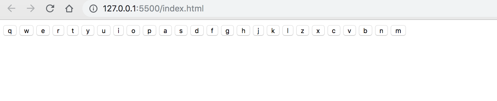
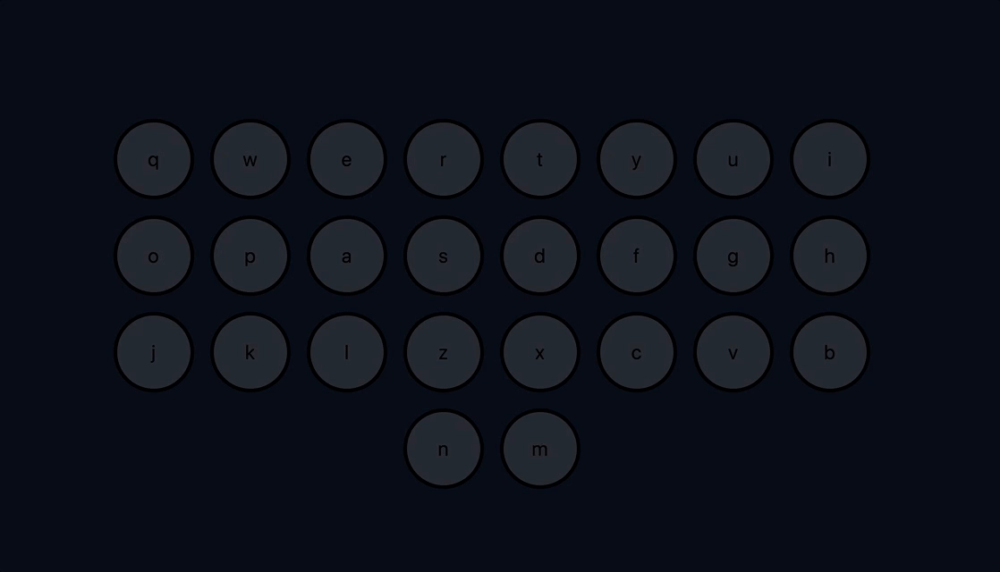
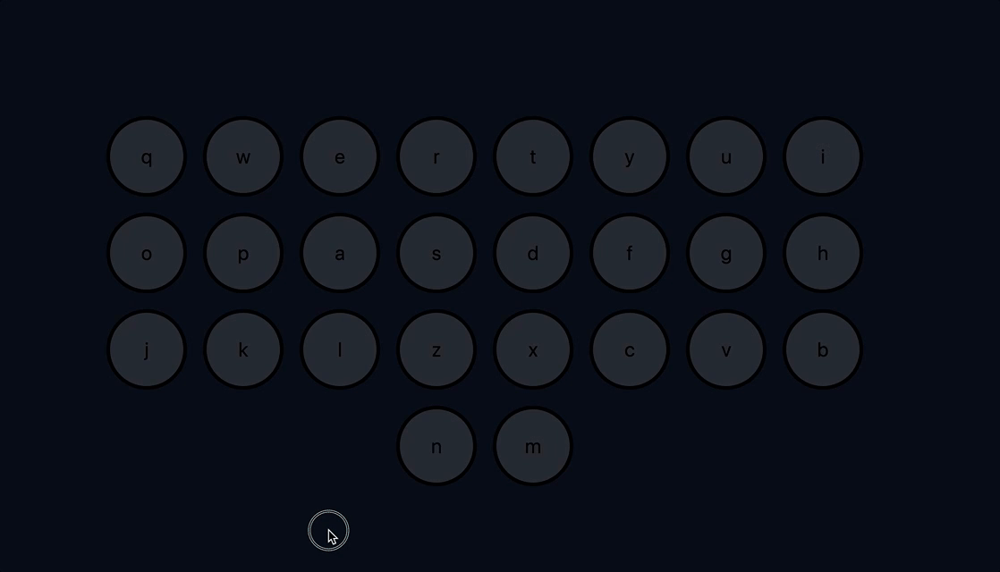
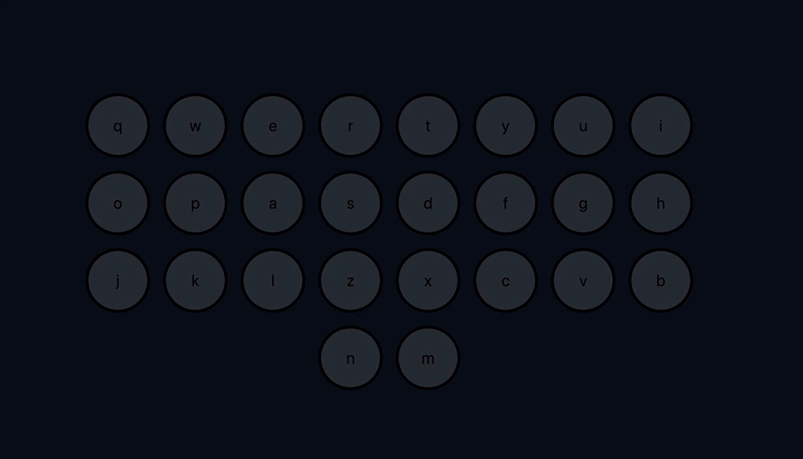

# Music Buttons - Day 128

Continuing on the project, and getting inspired by [Wes Bos's](https://wesbos.com/) 30 day Javascript challeneg, teh drun kit tutorial was all about
playing audio with keyboard events, and animating them. So let's get straign to it.

## Dependencies

So for this project, I wanted to grab some assets to work with.

* [fontAwesome](https://fontawesome.com/) was used for the icons
* [Neuronal-Synchrony Github Repo](https://github.com/jonobr1/Neuronal-Synchrony) which was used for the Audio clips

## Walkthrough

I'll start off with the functionality, then move on to styling.
so structure,

### HTML

for the page structure I was debating if I want the keys to be a `div` or make them `buttons`
and since I'm learning about a11y I decided to go with `buttons` with that said, I structured the
page as follows

``` html
<body>
    <main class="keys">
        <!-- keys to be pressed -->
        <button class="key" data-key="81">q</button>
        <button class="key" data-key="87">w</button>
        <button class="key" data-key="69">e</button>
        <button class="key" data-key="82">r</button>
        <button class="key" data-key="34">t</button>
        <button class="key" data-key="89">y</button>
        <button class="key" data-key="85">u</button>
        <button class="key" data-key="73">i</button>
        <button class="key" data-key="79">o</button>
        <button class="key" data-key="80">p</button>
        <button class="key" data-key="65">a</button>
        <button class="key" data-key="83">s</button>
        <button class="key" data-key="68">d</button>
        <button class="key" data-key="70">f</button>
        <button class="key" data-key="71">g</button>
        <button class="key" data-key="72">h</button>
        <button class="key" data-key="74">j</button>
        <button class="key" data-key="75">k</button>
        <button class="key" data-key="76">l</button>
        <button class="key" data-key="90">z</button>
        <button class="key" data-key="88">x</button>
        <button class="key" data-key="67">c</button>
        <button class="key" data-key="86">v</button>
        <button class="key" data-key="66">b</button>
        <button class="key" data-key="78">n</button>
        <button class="key" data-key="77">m</button>
    </main>

    <!-- audio resources -->
    <audio data-key="81" src="./assets/audio/clay.mp3"></audio>
    <audio data-key="87" src="./assets/audio/bubbles.mp3"></audio>
    <audio data-key="69" src="./assets/audio/confetti.mp3"></audio>
    <audio data-key="82" src="./assets/audio/flash-3.mp3"></audio>
    <audio data-key="34" src="./assets/audio/corona.mp3"></audio>
    <audio data-key="89" src="./assets/audio/suspension.mp3"></audio>
    <audio data-key="85" src="./assets/audio/dotted-spiral.mp3"></audio>
    <audio data-key="73" src="./assets/audio/flash-1.mp3"></audio>
    <audio data-key="79" src="./assets/audio/timer.mp3"></audio>
    <audio data-key="80" src="./assets/audio/piston-2.mp3"></audio>
    <audio data-key="65" src="./assets/audio/glimmer.mp3"></audio>
    <audio data-key="83" src="./assets/audio/moon.mp3"></audio>
    <audio data-key="68" src="./assets/audio/prism-2.mp3"></audio>
    <audio data-key="70" src="./assets/audio/pinwheel.mp3"></audio>
    <audio data-key="71" src="./assets/audio/flash-2.mp3"></audio>
    <audio data-key="72" src="./assets/audio/zig-zag.mp3"></audio>
    <audio data-key="74" src="./assets/audio/strike.mp3"></audio>
    <audio data-key="75" src="./assets/audio/splits.mp3"></audio>
    <audio data-key="76" src="./assets/audio/piston-3.mp3"></audio>
    <audio data-key="90" src="./assets/audio/prism-1.mp3"></audio>
    <audio data-key="88" src="./assets/audio/squiggle.mp3"></audio>
    <audio data-key="67" src="./assets/audio/wipe.mp3"></audio>
    <audio data-key="86" src="./assets/audio/prism-3.mp3"></audio>
    <audio data-key="66" src="./assets/audio/ufo.mp3"></audio>
    <audio data-key="78" src="./assets/audio/piston-1.mp3"></audio>
    <audio data-key="77" src="./assets/audio/veil.mp3"></audio>
</body>
```

Brilliant that's a start [most proboably will add sections for styling later but this will do for now].
this is how it currently looks like



### Javascript

okay with the structure out of the way, lets make it work. The idea is to have audio play when the proper key is pressed
or when the button is clicked. Lets start off with tackiling the keypress.

We want to target the whole page so for that readon we'll attach the event listner to the wondow object

``` js
// setting an event lister to the wndow object
window.addEventListener('keydown', playSound);
```

We haven't defined the playSound function yet, we'll do the now, but a couple of things I want to do here:

1. get a refrence to the audio that corresponds with the pressed key [using the keyCode]
2. get a refrence to the corresponding button [for animating purposes]
3. if the key pressed has a refrence to an audio element then
   1. reset the audio [for multiple clicks]
   2. play the audio
   3. add animation to the button
4. else just exit the function

with those steps in mind, we'd end up with a **playSound** function that looks like:

``` js
// play sound function
function playSound(e) {
    // grab the elements based on the key pressed
    const soundClip = document.querySelector(`audio[data-key="${e.keyCode}"]`);
    const btn = document.querySelector(`.key[data-key="${e.keyCode}"]`);

    if (!soundClip) return; // if teh audio doesn't exist just leave, leave...

    soundClip.currentTime = 0; // reset the audio
    soundClip.play();

    // TODO: add the animation class
    // btn.classList.add('')
}
```

Great now it plays the sound [you just have to take my word for it] and I still have to do the animation class ...
so I think it's a good time to start styling the app

### CSS

Not sure if I want to go into detail for my reasoning behind the style because as the name states it's style and
everyone has their own prefrence, but for the sake of explaining I'll just explain my reasoning behind a couple of choices

first off, I wanted to reset the margins, and paddings, and bound them based on their border [people will have conflicting opinions based on using the universal selector buuut the app is small so I can get away with this ;)]

``` css
    * {
    margin: 0;
    padding: 0;
    box-sizing: border-box;
}
```

so more importantly is the container and the items in them [which are the buttons] because i want to esily position them and have the design be responsive i'll use flexbox which gives me this sort of css styling

``` css
    .keys {
    margin: 20% auto 0;
    max-width: 960px;
    display: flex;
    flex: 1;
    justify-content: center;
    align-items: center;
    flex-wrap: wrap;
}

.key {
    width: 10rem;
    height: 10rem;
    margin: 1rem;
    font-size: 2.5rem;
    border-radius: 50%;
    background: #282c33;
    border: 4px solid #000;
    transition: all 0.08s;
}
```

awesome so what I have now is something that looks like this and is responsive


with it being responsive it's time to add the `.playing` class that will change the animation and using js
we will add it when clicked. For now I'll just add any reandom color [which I'll change later] which gives me

``` css
.playing {
    transform: scale(1.1);
    border-color: aqua;
    box-shadow: 0 0 1rem aqua;
}
```

now if I go back to the `app.js` file and add the class when it's clicked as such

``` js
// add the animation class
btn.classList.add('playing');
```

when we test it out in the browser what do we get



cool now lets jump back to javascript to fix the issue with removing the animation once done with the click/press

### Javascript [again]

okay we're almost there. I need now a way to remove the classes when the animation/transistion ends. To do that, I need to listen to the `treansitionend` event. But what will listen to this... well, since we are adding the transition to the `.key` class that's what we'll be targeting. Our steps would be as follows

1. select the keys
2. loop over those keys, and add an even listner to them that listens to the transition ending
3. in that function, we want to check if the transition is transform if it's not just exit
4. otherwise remove the class `.playing` from the element

with the steps outline for us lets get to work

``` js
function removeAnimation(e) {
    // if the property isn't transition just leave
    if (e.propertyName != 'transform') return;
    // otherwise remove the playing class from the element
    this.classList.remove('playing');
}
```

now lets test it out



okay now lets tackle the click functionality it;s basically the same just listening to button clicks for this I'm thinking of delegating the methods lets see if it works.

So I attached the event listner to the container, and did a little addition to assining the audio and element by checking of the keyCode doesn't exit just grab the target dataset key attribute so the function `playSound` update looks as follows

``` js
// play sound function
function playSound(e) {
    // grab the elements based on the key pressed
    const soundClip = document.querySelector(`audio[data-key="${e.keyCode}"]`) || document.querySelector(`audio[data-key="${e.target.dataset.key}"]`);
    const btn = document.querySelector(`.key[data-key="${e.keyCode}"]`) || document.querySelector(`.key[data-key="${e.target.dataset.key}"]`);

    if (!soundClip) return; // if the audio doesn't exist just leave, leave...

    soundClip.currentTime = 0; // reset the audio
    soundClip.play();

    // add the animation class
    btn.classList.add('playing');
}
```

so lets test this out and ...



So far so good, well this makes me think that I should also delegate the `removeAnimation` method as well instead of attching it
to each item [bravo on thinking about performance Athoug - I need to motivate myslef ]
with that said, I'll update the function to look like this

``` js
function removeAnimation(e) {
    // if the property isn't transition just leave
    if (e.propertyName != 'transform') return;
    // otherwise remove the playing class from the element
    e.target.classList.remove('playing'); // <- this is what changed
}
```

and now before I selected all `.key` elements and looped to attach listners to them

``` js
// selecting the keys and setting the 'transitionend' listener
- const keys = document.querySelectorAll('.key');
- keys.forEach(key => key.addEventListener('transitionend', removeAnimation));
```

but I chnged that and removed the code block above and just used the `.keys` element container and attached a
single lisner to it just like as illustrated bellow

``` js
// selecting the key container and setting the 'click' listener
const keysContainer = document.querySelector('.keys');
keysContainer.addEventListener('click', playSound);
+ keysContainer.addEventListener('transitionend', removeAnimation); // <- this is the addition
```