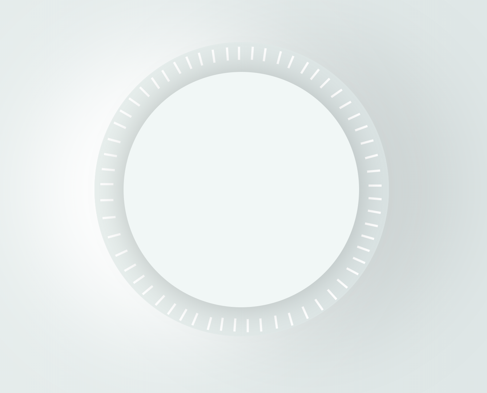
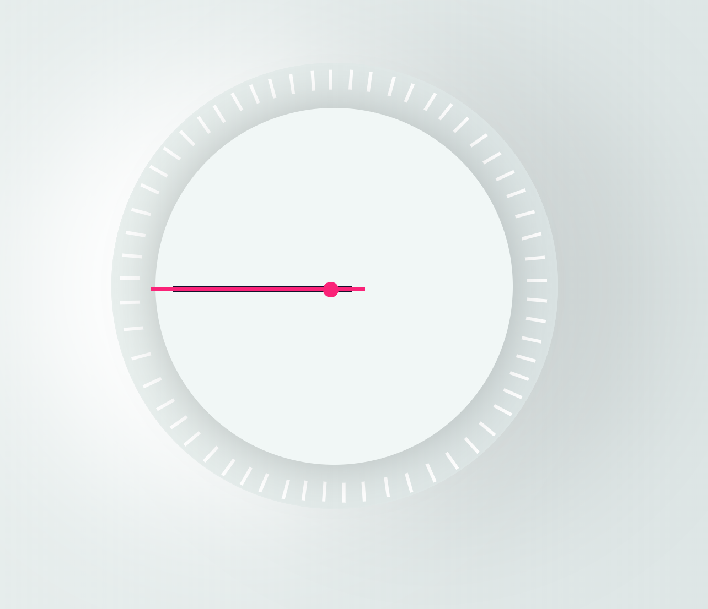
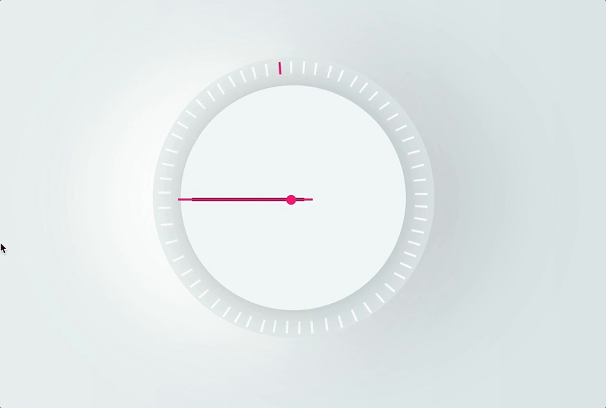
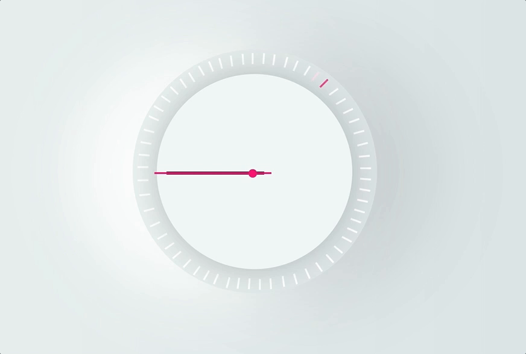
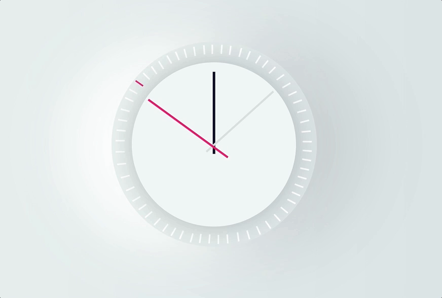

# Theme Clock

Buulding on the day 2 of the [30 day JS](https://javascript30.com/) challenge. I decided that for today I'll do the analog clock but style it based on this amazing design by [Gleb Kuznetsov](https://dribbble.com/shots/2286742-Alarm-Clock-Skin) and the thing is I want to implement that neon seconds progress circle and have a theme
where users can switch based on their prefrence if they want a dark or light theme. With that said lets get started.

## Dependences

A couble of libraries I will be using include:

* [Google Font](https://fonts.google.com/) for the fontface
* [Font Awesome](https://origin.fontawesome.com/) for the icons for light and dark themes

### HTML

I'll start the structure of the page based on the minimal style then later add on it so far the page structure looks
like so

``` html
 <main>
        <div class="container">
            <div class="seconds-container">
                <div class="seconds" data-key="0"></div>
                <div class="seconds" data-key="1"></div>
                <div class="seconds" data-key="2"></div>
                <div class="seconds" data-key="3"></div>
                <div class="seconds" data-key="4"></div>
                <div class="seconds" data-key="5"></div>
                <div class="seconds" data-key="6"></div>
                <div class="seconds" data-key="7"></div>
                <div class="seconds" data-key="8"></div>
                <div class="seconds" data-key="9"></div>
                <div class="seconds" data-key="10"></div>
                <div class="seconds" data-key="11"></div>
                <div class="seconds" data-key="12"></div>
                <div class="seconds" data-key="13"></div>
                <div class="seconds" data-key="14"></div>
                <div class="seconds" data-key="15"></div>
                <div class="seconds" data-key="16"></div>
                <div class="seconds" data-key="17"></div>
                <div class="seconds" data-key="18"></div>
                <div class="seconds" data-key="19"></div>
                <div class="seconds" data-key="20"></div>
                <div class="seconds" data-key="21"></div>
                <div class="seconds" data-key="22"></div>
                <div class="seconds" data-key="23"></div>
                <div class="seconds" data-key="24"></div>
                <div class="seconds" data-key="25"></div>
                <div class="seconds" data-key="26"></div>
                <div class="seconds" data-key="27"></div>
                <div class="seconds" data-key="28"></div>
                <div class="seconds" data-key="29"></div>
                <div class="seconds" data-key="30"></div>
                <div class="seconds" data-key="31"></div>
                <div class="seconds" data-key="32"></div>
                <div class="seconds" data-key="33"></div>
                <div class="seconds" data-key="34"></div>
                <div class="seconds" data-key="35"></div>
                <div class="seconds" data-key="36"></div>
                <div class="seconds" data-key="37"></div>
                <div class="seconds" data-key="38"></div>
                <div class="seconds" data-key="39"></div>
                <div class="seconds" data-key="40"></div>
                <div class="seconds" data-key="41"></div>
                <div class="seconds" data-key="42"></div>
                <div class="seconds" data-key="43"></div>
                <div class="seconds" data-key="44"></div>
                <div class="seconds" data-key="45"></div>
                <div class="seconds" data-key="46"></div>
                <div class="seconds" data-key="47"></div>
                <div class="seconds" data-key="48"></div>
                <div class="seconds" data-key="49"></div>
                <div class="seconds" data-key="50"></div>
                <div class="seconds" data-key="51"></div>
                <div class="seconds" data-key="52"></div>
                <div class="seconds" data-key="53"></div>
                <div class="seconds" data-key="54"></div>
                <div class="seconds" data-key="55"></div>
                <div class="seconds" data-key="56"></div>
                <div class="seconds" data-key="57"></div>
                <div class="seconds" data-key="58"></div>
                <div class="seconds" data-key="59"></div>
            </div>
            <div class="clock">
                <div class="hand second-hand"></div>
                <div class="hand minute-hand"></div>
                <div class="hand hour-hand"></div>
            </div>
        </div>
    </main>
```

okay I'll work with that for now. moving on to styling

### CSS

first the light theme. I'm trying to immulate the design and it was a bit touch since gradients are my bain. so far this is what I styled the body as

``` css
body {
    display: flex;
    justify-content: center;
    align-items: center;
    font-family: 'Lato', sans-serif;
    min-height: 100vh;
    background: rgb(234,240,239);
    background: linear-gradient(90deg, rgba(234,240,239,1) 0%, rgba(218,227,227,1) 100%);
}
```

and this gives us this light gradient background


okay now it's time [excuse the pun] for the clock both the container and the clock face styling would look like this

``` css
.container {
    position: relative;
    width: 45rem;
    height: 45rem;
    border-radius: 50%;
    background: rgb(233, 240, 238);
    background: linear-gradient(90deg, rgb(233, 240, 238) 0%, rgba(218,227,227,1) 100%);
    box-shadow: -10rem 0 20rem rgba(255,255,255,1),
                10rem 0 20rem rgba(0,0,0,0.1);
}

.clock {
    position: absolute;
    top: 10%;
    left: 10%;
    width: 80%;
    height: 80%;
    background: rgb(241, 247, 246);
    border-radius: 50%;
    box-shadow: 0 0 5rem rgba(0,0,0,0.2);
}
```

and lets see what we have so far


now is the tough part which is basically the seconds ticks. Now to be honist this was trial and error where I chose the positions of each tick based on my eye sight [apart from the 4 major corners] so for the css I won't detail all the positions you can just check it out in the `css` file yourself

``` css
.seconds-container {
    width: 100%;
    height: 100%;
    border-radius: 50%;
}

.seconds {
    position: absolute;
    width: 2rem;
    height: 0.3rem;
    background: #fff;
    transition: all 0.3s;
    transform: rotate(90deg);
}

/* seconds tick styles */
div[data-key="0"] {
    left: 47%;
    top: 3.5%;
}

div[data-key="1"] {
    right: 44%;
    top: 3.5%;
    transform: rotate(-86deg);
}

div[data-key="2"] {
    right: 40%;
    top: 4%;
    transform: rotate(-82deg);
}
```

This took a while [a really long while] but finally managed to make it and here's what we have so far



great now it's time for the handles and the

``` css
.hand {
    position: absolute;
    top: 50%;
    width: 50%;
    height: 6px;
    background: #16102C;
    transform-origin: 100%;
    transition: all 0.07s;
}

.hour-hand {
    left: 5%;
    width: 50%;
}

.minute-hand {
    width: 55%;
    top: calc(50% + 1.5px);
    height: 4px;
    background: rgb(217, 224, 222);
    transform-origin: 90%;
}

.second-hand {
    left: -5px;
    width: 60%;
    top: calc(50% + 1.5px);
    height: 4px;
    background: #FD1A77;
    transform-origin: 80%
}

.circle-clock {
    position: absolute;
    left: 47%;
    top: 49%;
    width: 1.5rem;
    height: 1.5rem;
    border-radius: 50%;
    background: #FD1A77;
}

```

aaand we have



for now we'll stop with the css and make the clock functional

### Javascript

The first thing to takle here would be the seconds ticker and the plan is get the current second, get the element that corresponds to that second add the class to it so with that said, the time function would look like

``` js
function time() {
    const now = new Date();
    const secondTick = document.querySelector(`div[data-key="${now.getSeconds()}"]`);
    secondTick.classList.add('active-second');
}

setInterval(time, 1000);
```

and what we have now is



great now to remove the active when the second ends, to do that I'll add an event listner to the container and check for the `transitionend` and then remove the class form the targeted element

``` js
function removeActive(e) {
    if (e.propertyName !== 'background-color') return;
    e.target.classList.remove('active-second');
}
```

brilliant, it now works



now it's time for the handels which is basically converting time to an angle using the formula (current time/total time units) * 360 so our function looks like so

``` js
function time() {
    const now = new Date();

    const secondTick = document.querySelector(`div[data-key="${now.getSeconds()}"]`);
    secondTick.classList.add('active-second');

    const seconds = now.getSeconds();
    const secondsDegree = ((seconds/60) * 360) + 90;
    secondsHand.style.transform = `rotate(${secondsDegree}deg)`;

    const minutes = now.getMinutes();
    const minutesDegree = ((minutes / 60) * 360) + 90;
    minutesHand.style.transform = `rotate(${minutesDegree}deg)`;

    const hour = now.getHours();
    const hourDegree = ((hour / 12) * 360) + 90;
    hourHand.style.transform = `rotate(${hourDegree}deg)`;
}
```

It works and i'm happy about it. True the tick seconds isn't synced with the handle I knew this will hapen and that's due to my not so accurate positioning for those ticks but regardless not bad



## Resources

A list of resources that helped with this project:

* [Javascript 30](https://javascript30.com/)
* [UI Inperation](https://dribbble.com/shots/2286742-Alarm-Clock-Skin)
* [Gradient Generator](https://cssgradient.io/)
* [CSS-Ticks: progrss bar](https://css-tricks.com/building-progress-ring-quickly/) Article
* [Codepen progress bar demo](https://codepen.io/jo-asakura/pen/stFHi)
* [CSS-Tricks: transform](https://css-tricks.com/almanac/properties/t/transform/) Article
* [SVG animation](https://jakearchibald.com/2013/animated-line-drawing-svg/)
* [MDN: translateX](https://developer.mozilla.org/en-US/docs/Web/CSS/transform-function/translateX)
* [MDN: Specificity](https://developer.mozilla.org/en-US/docs/Web/CSS/Specificity)
* [MDN: String includes prototype](https://developer.mozilla.org/en-US/docs/Web/JavaScript/Reference/Global_Objects/String/includes)
* [MDN: Date Object](https://developer.mozilla.org/en-US/docs/Web/JavaScript/Reference/Global_Objects/Date)