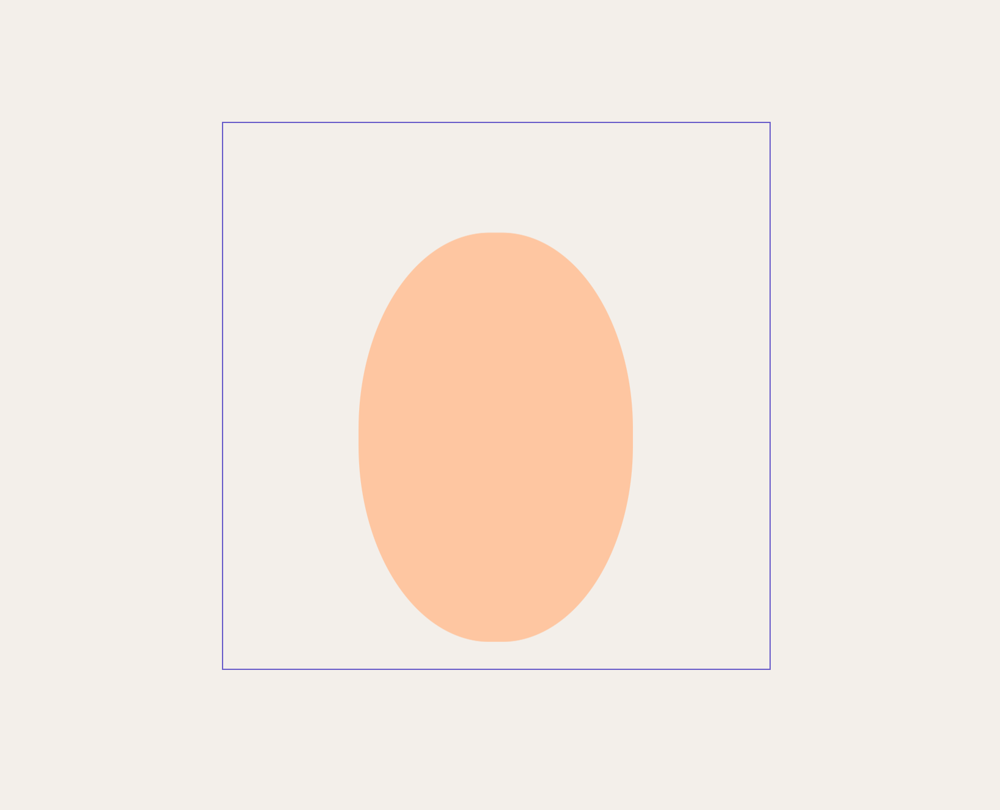
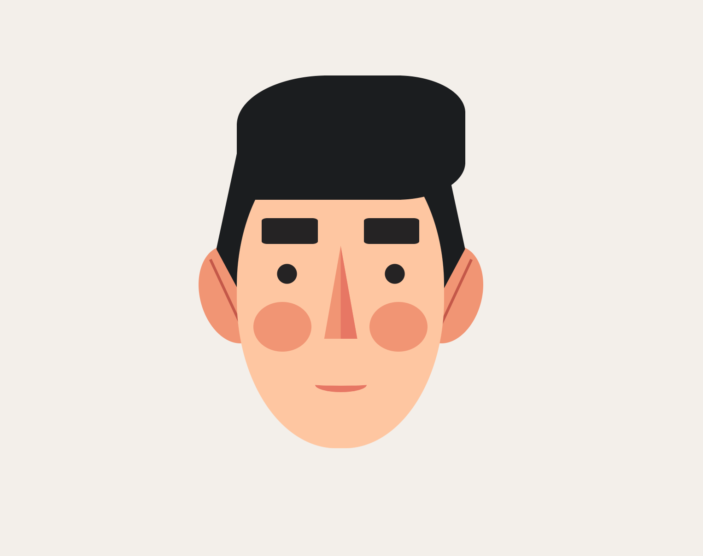
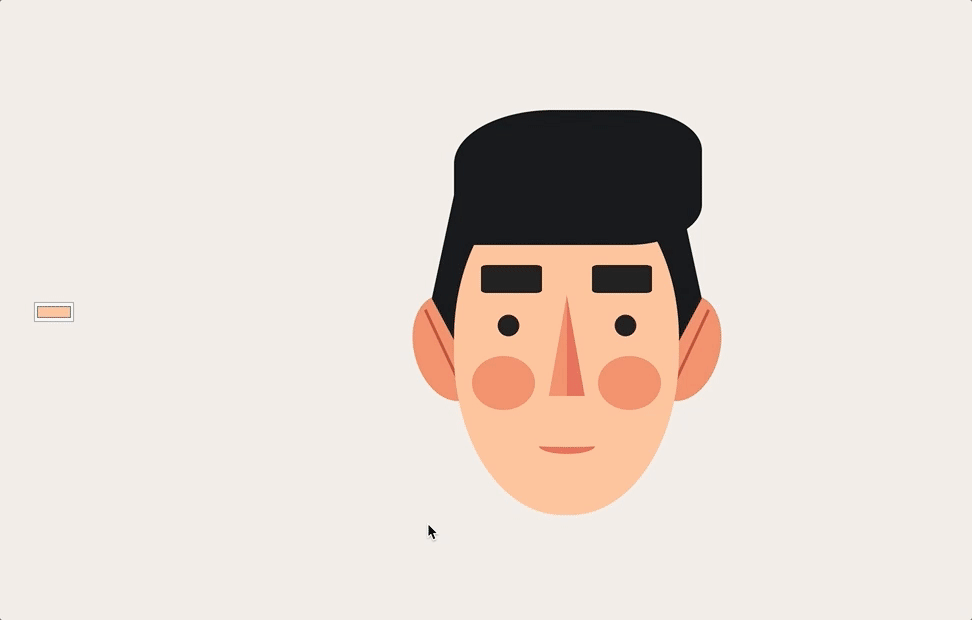
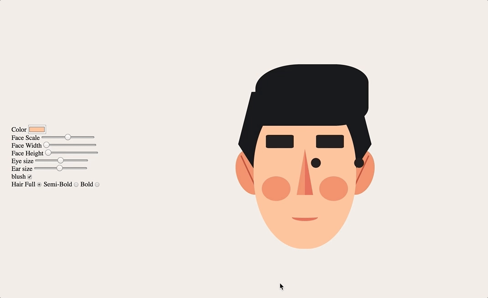
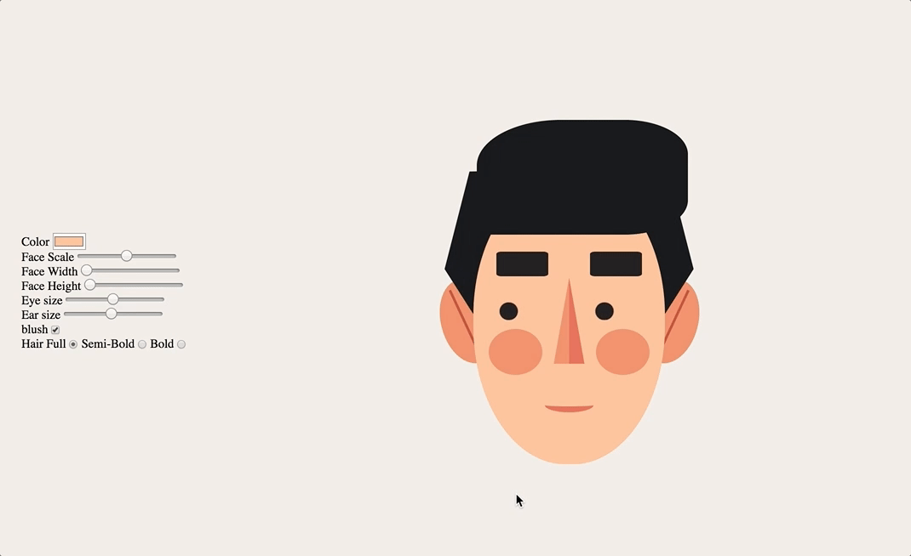

# Face Control - Day 130

We contine working on this project and this time based on the Javascript30 course day 3 was about CSS variables and manipulating them with JS. With that idea in mind, I want to make a face CSS image where useres can change the feature [what they can controll of course] and reflect teh change on the image. OKay lets start!

## Dependencies

A list of the dependencies for this project

## Walkthrough

We start off this project by first structuering the html.

### HTML

I want to have the controlls on the side and the main face in the midlle but first I want to focus on constructing the facial components and based on that, the html looks like so

```html
    <main>
        <div class="container">
            <div class="hair"></div>
            <div class="ear-left">
                <div class="inner-ear-l"></div>
            </div>
            <div class="ear-right">
                <div class="inner-ear-r"></div>
            </div>
            <div class="face">
                <div class="nose">
                    <div class="nose-shade"></div>
                </div>
                <div class="eye-l"></div>
                <div class="eye-r"></div>
                <div class="eye-brow-l"></div>
                <div class="eye-brow-r"></div>
                <div class="blush-l"></div>
                <div class="blush-r"></div>
                <div class="mouth"></div>
            </div>
        </div>
    </main>
```

We won't see anything at the moment but when we start working on style, the magic happenes which we'll do now

### CSS

For the styleing, the main thing is to have a container element that will be the relative size indicator so in that element I'll specify hard picel units and the nested elements will be absolute positions based on that container div along with relative sizing so the code bellow shows how the face class usuas relative sizing to it's parent [which is the container]

``` css
.container {
    margin: auto;
    position: relative;
    display: block;
    width: 500px;
    height: 500px;
    background: transparent;
    border: 1px solid slateblue;
}

/* face style */
.face {
    position: absolute;
    bottom: 5%;
    left: 25%;
    width: 50%;
    height: 75%;
    background: var(--skin);
    border-radius: 48%;
}
```

and what we get is this [please ignore the purple border I'm using it for testing]



okay let me firt show the relationship between the components

``` txt
    container [parent]
        hair [child of container | siblin of bellow elements]
        ear left [child of container | siblin of bellow elements]
        ear right [child of container | siblin of bellow elements]
        face [child of container | siblin of above elements]
            eye left [child of face | sibling of bellow elements]
            eye right [child of face | sibling of bellow elements]
            eye brow left [child of face | sibling of bellow elements]
            eye brow right [child of face | sibling of bellow elements]
            nose [child of face | sibling of bellow elements]
            blush left [child of face | sibling of bellow elements]
            blush right [child of face | sibling of bellow elements]
            mouth [child of face | sibling of bellow elements]
```

okay with that in mind lets get to styling. I wont dive deep into CSS images there's a nice article by [Michael Mangialardi](https://medium.com/coding-artist/a-beginners-guide-to-pure-css-images-ef9a5d069dd2) as well as a [coure](https://coding-artist.teachable.com/p/how-to-make-pure-css-images) that I do recommend. That's where I learned about CSS images to begin with. moving on

``` css
/* ear styling */
.ear-left {
    position: absolute;
    bottom: 30%;
    left: 16%;
    width: 16%;
    height: 24%;
    background: var(--ear-color);
    border-radius: 50%;
    overflow: hidden;
    transform: rotate(-15deg);
}

.inner-ear-l {
    position: absolute;
    bottom: 1%;
    left: 40.5%;
    background: var(--inner-ear-color);
    width: 4%;
    height: 90%;
    transform: rotate(-10deg);
}

.ear-right {
    position: absolute;
    bottom: 30%;
    right: 16%;
    width: 16%;
    height: 24%;
    background: var(--ear-color);
    border-radius: 50%;
    overflow: hidden;
    transform: rotate(15deg);
}

.inner-ear-r {
    position: absolute;
    bottom: 1%;
    right: 40.5%;
    background: var(--inner-ear-color);
    width: 4%;
    height: 90%;
    transform: rotate(10deg);
}


/* face style */
.face {
    position: absolute;
    bottom: 5%;
    left: 25%;
    width: var(--face-width);
    height: var(--face-height);
    background: var(--skin-color);
    border-radius: 48%;
}
/* nose styling */
.nose {
    position: absolute;
    left: 40%;
    top:  35%;
    width: 20%;
    height: 30%;
    background: var(--nose-color);
    -webkit-clip-path: polygon(50% 0%, 10% 100%, 90% 100%);
            clip-path: polygon(50% 0%, 10% 100%, 90% 100%);
}

.nose-shade {
    position: absolute;
    width: 100%;
    height: 100%;
    background: var(--nose-shade-color);
    -webkit-clip-path: polygon(50% 0, 100% 100%, 50% 100%);
            clip-path: polygon(50% 0, 100% 100%, 50% 100%);
}
/* eyes styling */
.eye-l {
    position: absolute;
    top: 40%;
    left: 18%;
    width: 12%;
    height: 8%;
    background: var(--eye-color);
    border-radius: 50%;
    transform: scale(0.8)
}

.eye-r {
    position: absolute;
    top: 40%;
    right: 18%;
    width: 12%;
    height: 8%;
    background: var(--eye-color);
    border-radius: 50%;
    transform: scale(0.8)
}
/* eye brows styling */
.eye-brow-l {
    position: absolute;
    left: 12%;
    top: 26%;
    width: 27%;
    height: 8.5%;
    border-radius: 10%;
    background: var(--eye-brow-color);
}

.eye-brow-r {
    position: absolute;
    right: 12%;
    top: 26%;
    width: 27%;
    height: 8.5%;
    border-radius: 10%;
    background: var(--eye-brow-color);
}
/* blush styling */
.blush-l {
    position: absolute;
    left: 8%;
    bottom: 31%;
    width: 28%;
    height: 16%;
    background: var(--blush-color);
    border-radius: 50%;
    transform: scale(1);
}

.blush-r {
    position: absolute;
    right: 8%;
    bottom: 31%;
    width: 28%;
    height: 16%;
    background: var(--blush-color);
    border-radius: 50%;
    transform: scale(1);
}
/* mouth styling */
.mouth {
    position: absolute;
    left: 37.5%;
    bottom: 18%;
    width: 25%;
    height: 5%;
    border-bottom: 0.5rem solid var(--mouth-color);
    border-bottom-left-radius: 50%;
    border-bottom-right-radius: 50%;
    /* background: var(--mouth-color); */
}


/* hair styling */
.hair-back {
    position: absolute;
    left: 20%;
    top: 5%;
    width: 60%;
    height: 70%;
    background: var(--hair-color);
   -webkit-clip-path: polygon(48% 19%, 90% 20%, 100% 60%, 75% 100%, 25% 100%, 0% 60%, 10% 20%);
           clip-path: polygon(48% 19%, 90% 20%, 100% 60%, 75% 100%, 25% 100%, 0% 60%, 10% 20%);
}

.hair-front {
    position: absolute;
    left: 25%;
    top: 5%;
    width: 55%;
    height: 30%;
    background: var(--hair-color);
    border-top-left-radius: 40%;
    border-top-right-radius: 30%;
    border-bottom-left-radius: 5%;
    border-bottom-right-radius: 30%;
}

```

and with those rule sets we get this lovely chap



now lets move on to the functionality

### Javascript

I wanted to start off with the color. For this I wanted to have an initial element that changes and when the user clicks on an element, They have the option of chnaging that elements color. My approach was as such:

1. Create a pointed variable that isn't defined.
2. Attach an event listner to the container that assigns the variable to the pointed element
3. then select the color input and attach an event listner to it and if no element is selected have the defult face to be changed
4. change the css variable for that elements color

with the steps outlined, my JS code looks as such

``` javascript
let selectedFeature;
const face = document.querySelector('.face');

// function to set up the pointer element for color changes
function setPointerElement(e) {
  // make sure the element isn't the container
  if ([...e.target.classList].includes('container')) return; // exit of it's the container
  selectedFeature = e.target; // set the selector to the target element
}

// function to change the color of the element
function colorMe() {
  // 1. get the color value
  const color = this.value;
  // 2. get the selected element if no element was selected, color the skin
  const selected = selectedFeature || face;
  // 3. re-assign the css variable based on teh input value
  document.documentElement.style.setProperty(`--${selected.dataset.key}-color`, color);
}

// add lisner to container, and record the pointer
document.querySelector('.container').addEventListener('click', setPointerElement);

// select the color input and add a listner
const inputColor = document.querySelector('.controls input[type="color"]');
inputColor.addEventListener('change', colorMe);
```

Now when I refresh the page I get



Brilliant! Now following the same approach, I wanted to add a couple of customization such as eye size, face scale [individual width and height], ear size, hair..etc For this though, I used the name attribute to the input elements to help me with changing the css variable. Meaning my html looks as such

``` html
<div>
    <label for="eye-scale">Eye size </label>
    <!-- Note the attribute bale "eye-scale" which corresponds with the css variable name in the main.css file -->
    <input id="eye-scale" type="range" value="1" name="eye-scale" min="0.1" max="2" step="0.1">
</div>
```

with that, I did the same steps of selecting the inputs, attaching an event listner to them and changing the property through the root document by grabing the input value and name attribute so the JS code looks like

``` javscript
    // function to change the faces dismentions
    function changeDismentions() {
    const suffix = this.dataset.suffix || '';
    // get the changed value [this.value] | get the name [this.name] of the variable to be changed
    document.documentElement.style.setProperty(`--${this.name}`, `${this.value}${suffix}`);
    }

    const inputsRange = document.querySelectorAll('.controls input[type="range"]');
    inputsRange.forEach(input => input.addEventListener('change', changeDismentions));
```

Same approach was taken with the rest of the inputs which makes us have controls that changes a couple of things so here's a demo of what we have so far


okay now I'm officially done, but I do want to add some house keeping.

first, **Eye Movment**: I want the eyes to move with the locatin of the mouse. To do so, I first need to target the document, get the coordenated and then try update the eyes wusing the `translate` property. I was following a pen by [Jeremey on codepen](https://codepen.io/J-Roel/pen/wWGNQN?editors=1010). It took me some time to convert the method to vanilla JS but managed to do so, however...



Hummm so I need to bound the movment. Here's where I stumbled a bit. I wanted to keey it within a specific box I kept randomly experamenting by adding number, subtracting numbers but to no avail, but then when I devided it worked! so my JS looks as such

``` javascript
const eyes = document.querySelectorAll('.eye');

// function to track eye movment
function eyeMovment(e) {
  // note: This function is based on the pen my Jeremy [https://codepen.io/J-Roel/pen/wWGNQN?editors=0010]
  eyes.forEach((eye) => {
    const x = (eye.getBoundingClientRect().left) + (eye.getBoundingClientRect().width / 2);
    const y = (eye.getBoundingClientRect().top) + (eye.getBoundingClientRect().height / 2);
    const xPage = (e.pageX - x) / 6;
    const yPage = (e.pageY - y) / 5.5;

    eye.style.setProperty('transform', `scale(var(--eye-scale)) translateX(${xPage}%) translateY(${yPage}%)`);
  });
}

body.addEventListener('mousemove', eyeMovment);
```

and



