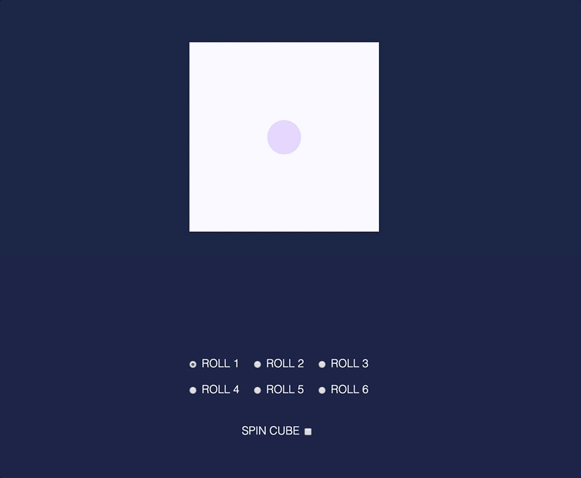

# 3D Dice - Day 132

I'm trying to learn how to implement 3d objects in CSS. I'm following along the tutorials of [David DeSandro](https://3dtransforms.desandro.com/). I want to make a 3d cube that is basically a dice so it uses a bit of css images by positioning
the circles relative to their parents.

This is how it ended up looking as:

## Resources

Listed bellow are teh resources that helped me make this:

* [Color Pallete](https://coolors.co/30343f-fafaff-e4d9ff-273469-1e2749)
* [CSS Perspective](https://3dtransforms.desandro.com/perspective)
* [CSS Cube](https://3dtransforms.desandro.com/cube)
* [Codepen: Cude](https://codepen.io/desandro/pen/KRWjzm?editors=0010)
* [Codepen: Rotate cube](https://codepen.io/desandro/pen/bMqZmr?editors=0110)
* [Stackoverflow: checked state](https://stackoverflow.com/questions/8206565/check-uncheck-checkbox-with-javascript)